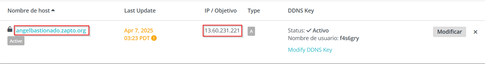
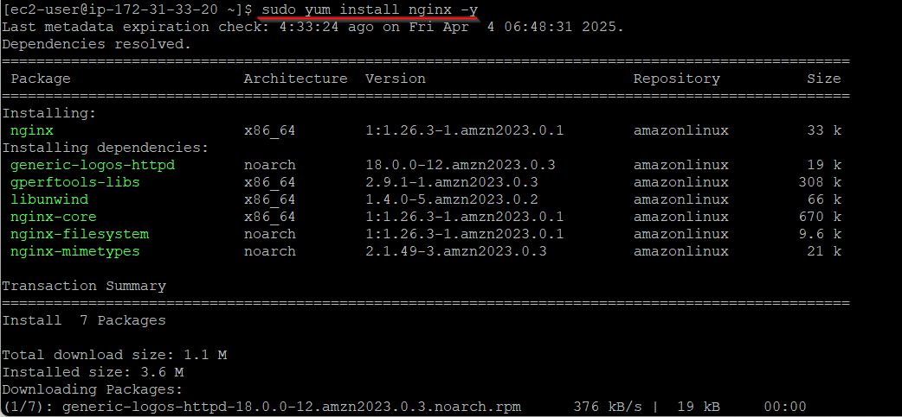
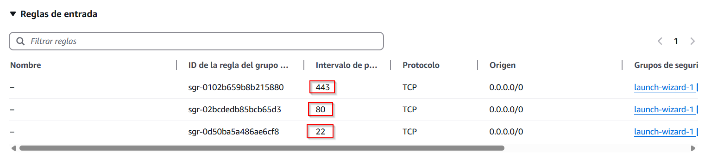
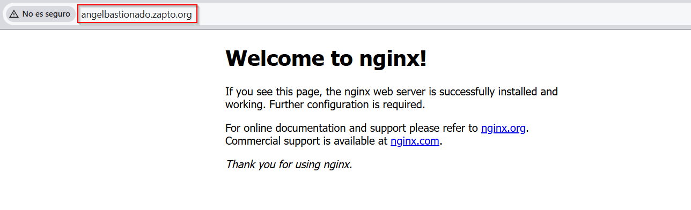
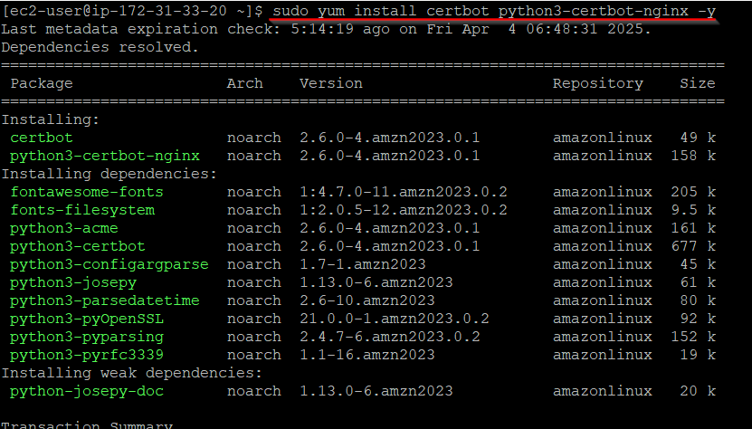
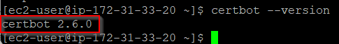
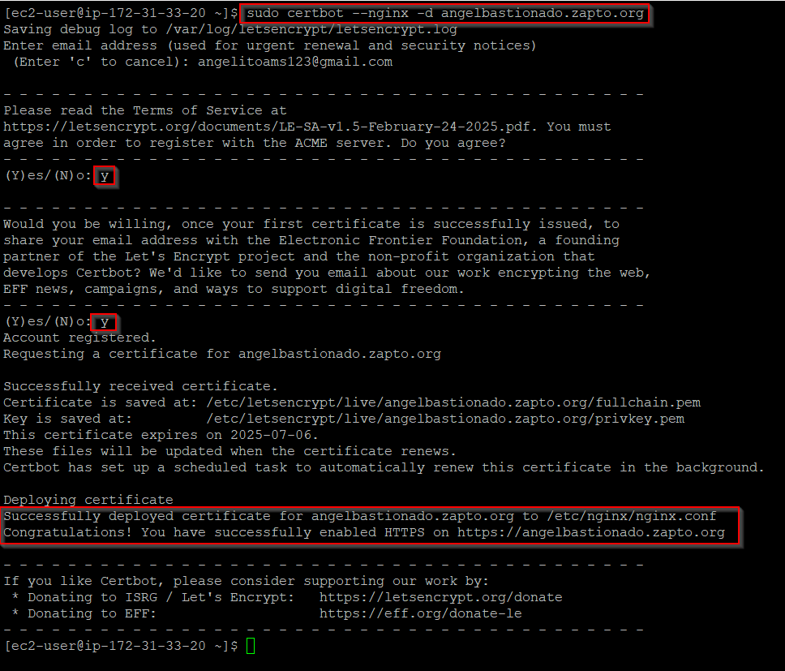
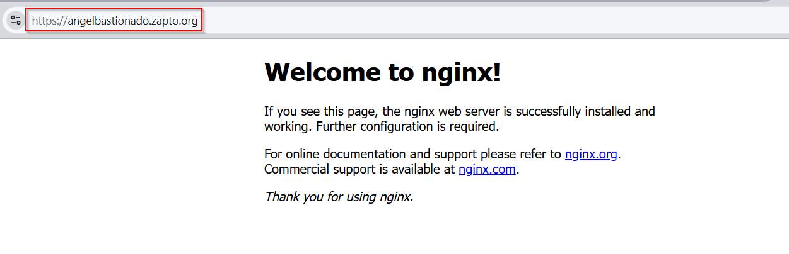
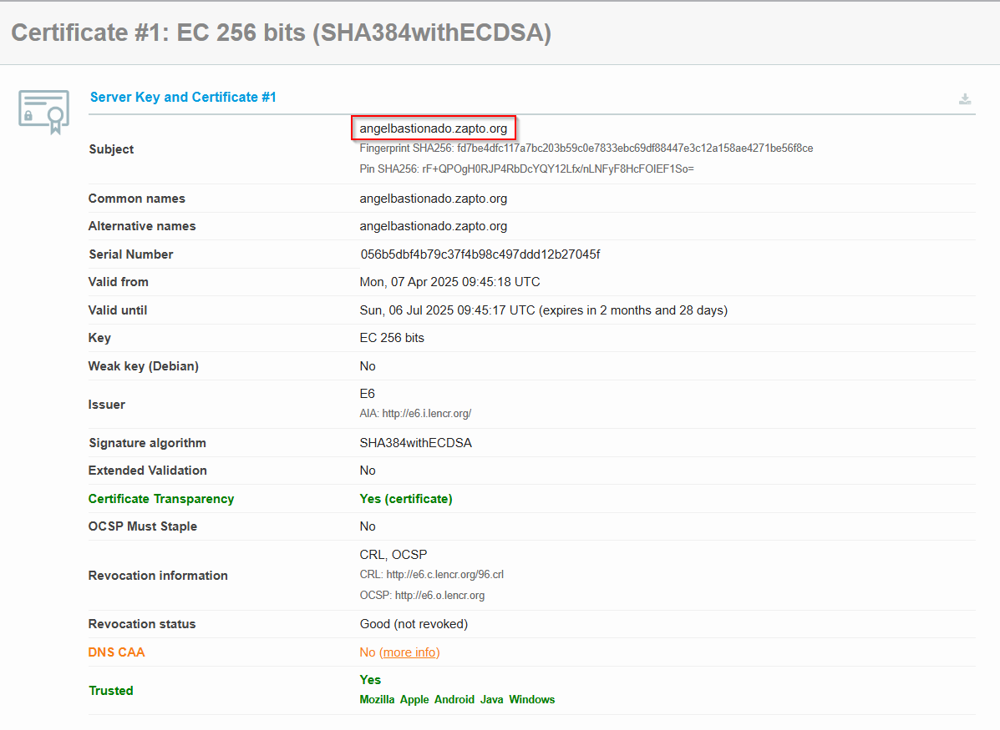
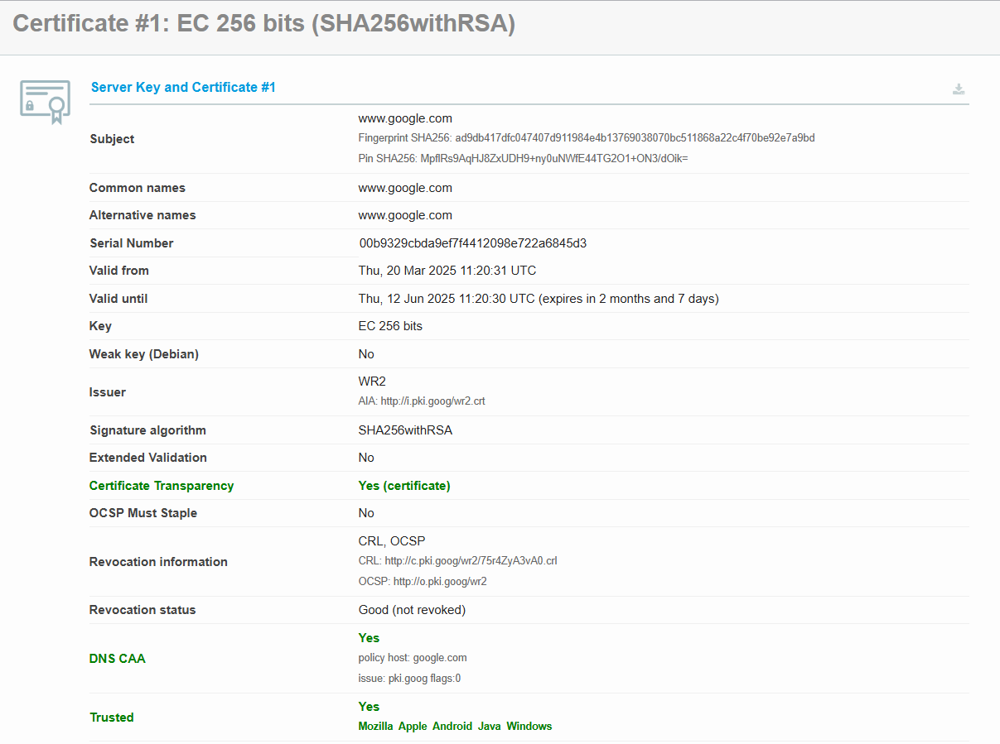

# Parte 2 - Vía Realista

En esta etapa, procedemos a crear un subdominio utilizando el servicio **No-IP**, con el objetivo de asociar la dirección IP pública proporcionada por nuestra instancia en AWS. Para ello, accedimos a la página oficial de No-IP y seguimos los pasos indicados:

1.  Nos autenticamos en No-IP utilizando una cuenta de Google, GitHub o Twitter.
    
2.  En el apartado **"Hostnames"**, elegimos un nombre único para nuestro subdominio.
    
3.  Registramos el subdominio haciendo clic en **"Create Hostname"** y, posteriormente, asociamos la dirección IP pública de nuestra instancia EC2 al subdominio creado.

  

A continuación, procedemos a instalar el servidor web NGINX en nuestra instancia EC2. Para ello, ejecutamos el siguiente comando en la terminal:

Para permitir el acceso al servidor web, es necesario configurar las reglas de seguridad en el grupo de seguridad de nuestra instancia EC2. Estas reglas controlan el tráfico entrante y saliente. Se deben agregar las siguientes reglas:

- **HTTP (puerto 80)**: Permitir tráfico desde cualquier IP (0.0.0.0/0) para acceso público al servidor web.
    
- **HTTPS (puerto 443)**: Permitir tráfico desde cualquier IP (0.0.0.0/0) para conexiones seguras.
    
- **SSH (puerto 22)**: Permitir tráfico desde nuestra IP pública específica para gestión segura.
    

Para verificar el funcionamiento de **NGINX**, accedemos a la dirección IP pública o al subdominio configurado.

 

## Configuración de HTTPS con Let's Encrypt

Para habilitar HTTPS en nuestro servidor web, instalaremos **Certbot**, una herramienta que facilita la obtención y configuración de certificados SSL/TLS gratuitos proporcionados por Let's Encrypt. El comando utilizado para la instalación es el siguiente:

Para confirmar que Certbot se ha instalado correctamente, ejecutamos el siguiente comando en la terminal:

 

## Obtención del certificado SSL

Para habilitar HTTPS en nuestro subdominio de "*zapto.org*", utilizamos Certbot para obtener un certificado SSL gratuito de Let's Encrypt. El comando ejecutado es el siguiente:

Este comando solicita y configura automáticamente el certificado para el subdominio especificado, permitiendo así conexiones seguras mediante HTTPS. Una vez completado, el servidor estará listo para manejar tráfico seguro.

Durante la configuración del certificado SSL, encontramos un inconveniente debido a la falta del subdominio en el archivo `nginx.conf`. Para solucionarlo, editamos el archivo y agregamos el subdominio en el campo `server_name`. Luego, reiniciamos NGINX para aplicar los cambios. Por último, volvimos a ejecutar Certbot con el comando `sudo certbot --nginx -d angelbastionado.zapto.org` para reinstalar el certificado SSL correctamente.

Para comprobar que el certificado SSL está funcionando correctamente, accedemos al subdominio configurado en un navegador mediante la URL `https://angelbastionado.zapto.org`.

 

## Comparativa entre los certificados

Certificado de mi subdominio:

Ahora lo realizaremos de google:

 

## Tabla comparativa

| Característica | Mi Sitio Web (angelbastionado.duckdns.org) | Google (www.google.com) |
| --- | --- | --- |
| Subject (Common Name) | angelbastionado.zapto.org | www.google.com |
| Issuer | E6  | Google Trust Services LLC |
| Serial Number | 056b5dbf4b79c37ff4b98c497ddd12b27045f | 00:b9:32:9c:bd:a9:ef:7f:41:20:99:e7:22:a6:84:5d:3 |
| Algoritmo Firma | SHA384withECDSA | SHA256withRSA |
| Validez | 07/04/2025 al 06/07/2025 | 20/03/2025 al 12/06/2025 |
| Extensiones SAN | angelbastionado.zapto.org | \*.google.com, google.com |
| OCSP | [http://e6.o.lencr.org](http://e6.o.lencr.org/) | http://crl.google.com/75r42iyA3yA0.crl |
| DNS CAA | Sí  | Sí  |
| Huella Digital (SHA-256) | 1d7ea4ddc117a7bc203b59c0e7633ebc69dd88447a3c12a158aae4271be56ff8ce | ad9db417dfc047407df11984e4e13769038070bc511868a22c4770be592e7a9bd |

* * *

## Tipos de certificados

**Certificado Let's Encrypt:** El certificado utilizado en mi sitio web `angelbastionado.zapto.org` es emitido por `E6` y utiliza el algoritmo de firma `SHA384withECDSA`. Este certificado es de tipo Domain Validation (DV), que verifica únicamente la propiedad del dominio. Es ideal para proyectos personales o pequeños sitios web debido a su facilidad de obtención y costo cero. Además, cuenta con transparencia de certificado (Certificate Transparency) y validación DNS CAA.

**Certificado Google:** El certificado utilizado por Google (`www.google.com`) es emitido por `Google Trust Services LLC` y utiliza el algoritmo de firma `SHA256withRSA`. Es un certificado comercial que no incluye validación extendida (EV) según la información proporcionada. Asegura la propiedad del dominio y la comunicación cifrada, lo cual es esencial para sitios web con alto tráfico y empresas. Además, cuenta con transparencia de certificado (Certificate Transparency) y validación DNS CAA.