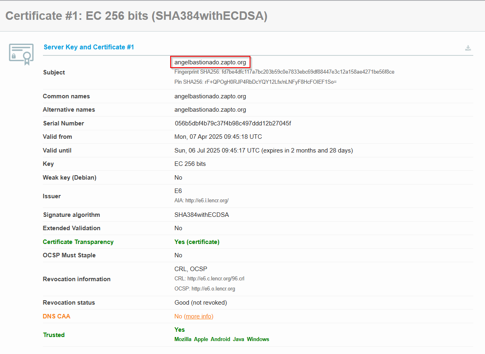
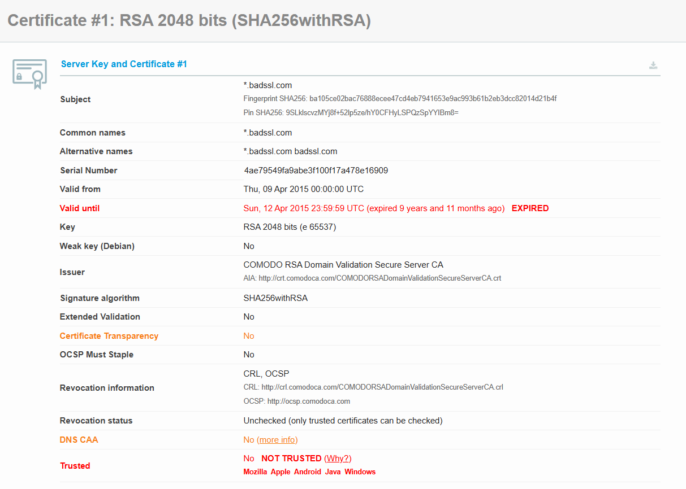
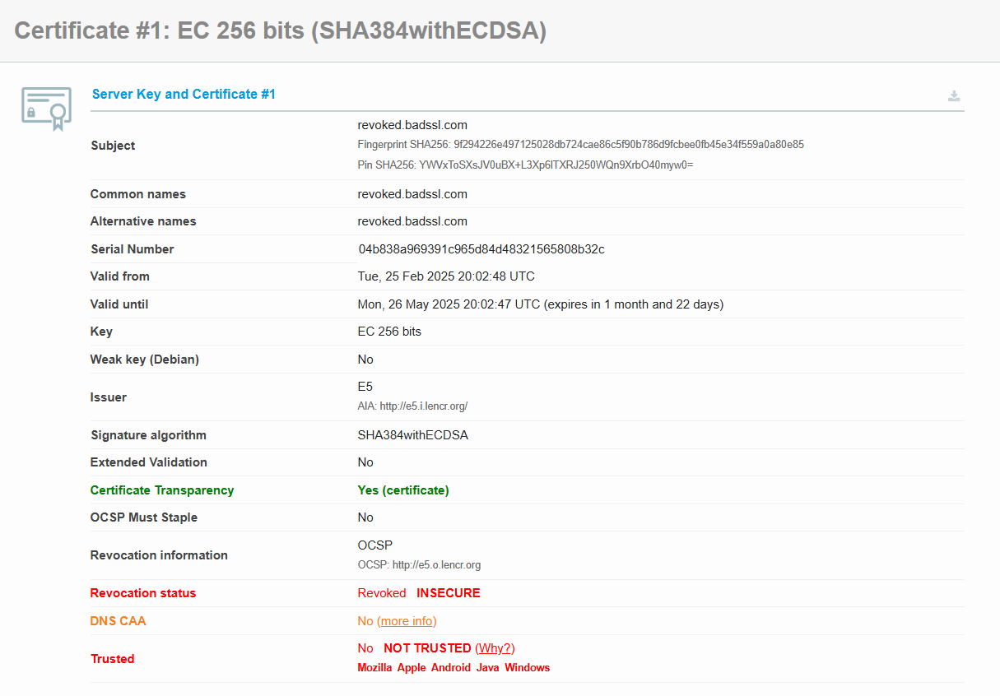
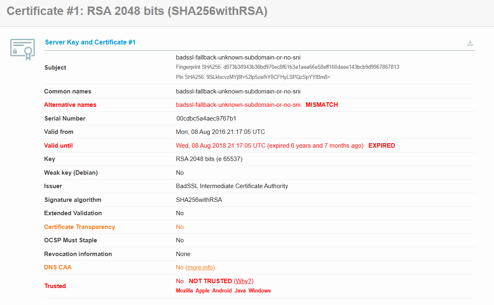

# Parte 3. Vía realista

Ahora analizaremos el certificado válido del sitio web de la parte 2, en este caso es el certificado de la página web `angelbastionado.zapto.org`:

Si vemos las opciones, veremos que el certificado es válido porque:

1.  **Emitido por una Autoridad de Certificación (CA) de Confianza**: El certificado fue emitido por "E6", que es una entidad de confianza de Let's Encrypt.
    
2.  **Cifrado Fuerte**: Utiliza EC 256 bits, lo que significa que está utilizando una clave de cifrado de nivel fuerte y que es difícil de romper.
    
3.  **Algoritmo de Firma Seguro**: El algoritmo de firma es SHA384withECDSA, que es actualmente considerado seguro y es utilizado para firmar certificados digitales.
    
4.  **Transparencia del Certificado**: Tiene transparencia del certificado, es decir, el certificado está registrado en registros públicos y auditable.
    
5.  **Estado de Revocación**: El estado de revocación es "Bueno (no revocado)", lo que significa que el certificado no ha sido revocado por la CA y sigue siendo de confianza.
    
6.  **Validación de DNS CAA**: Nos indica que sí lo tiene, es decir, que el dominio tiene políticas que especifican qué CAs están autorizadas para emitir certificados para el dominio.
    
7.  **Trusted (Confianza)**: El certificado es de confianza en múltiples plataformas (Mozilla, Apple, Android, Java, Windows), lo que indica que las principales plataformas de software confían en la CA que emitió el certificado.
    

 

## Sitios web con certificados inválidos

A continuación, elegiremos 3 páginas web con certificados inválidos de distintos tipos, para analizarlo lo haremos con el servicio: <ins>https://www.ssllabs.com/ssltest/</ins>

Hemos seleccionado estas 3 webs y cada una tiene un problema con sus certificados:

El primer sitio web es: <ins>https://expired.badssl.com/</ins>

- **Certificado Caducado:** El certificado expiró el "Sun, 12 Apr 2015 23:59:59 UTC (expired 9 years and 11 months ago)". Esto significa que el certificado ya no es válido y no debe ser confiable.
- **No Confiable (Not Trusted)**: El certificado no es confiable en múltiples plataformas (Mozilla, Apple, Android, Java, Windows), lo que indica que hay problemas con la validez o la configuración del certificado.
- **Falta de Transparencia del Certificado**: La opción "Certificate Transparency" está marcada como "No", lo que indica que el certificado no está registrado en registros públicos y auditables.
- **Estado de Revocación No Verificado**: El estado de revocación está marcado como "Unchecked", lo que significa que no se ha verificado si el certificado ha sido revocado por la CA.

---

El segundo sitio web es: <ins>https://revoked.badssl.com/</ins>

- **Estado de Revocación (Revoked INSECURE)**: El certificado ha sido revocado, lo que indica que ya no es seguro y no debe ser confiable.
- **No Confiable (NOT TRUSTED)**: El certificado no es confiable en múltiples plataformas (Mozilla, Apple, Android, Java, Windows), lo que indica problemas con la validez o configuración del certificado.
- **Falta de DNS CAA**: La opción "DNS CAA" está marcada como "No", lo que significa que el dominio no tiene políticas que especifiquen qué CAs están autorizadas para emitir certificados.
- **Algoritmo de firma**: El certificado utiliza SHA384withECDSA, aunque es seguro, la revocación lo hace inválido.
- **Información de revocación**: El estado Revoked INSECURE indica que el certificado ha sido explícitamente invalidado por la autoridad de certificación.

---

El tercer sitio web es: <ins>[https://wrong.host.badssl.com/](https://self-signed.badssl.com/)</ins>

1.  **Validez Expirada**: El certificado expiró el "Wed, 08 Aug 2018 21:17:05 UTC", lo que significa que ya no es válido.
    
2.  **Nombres Alternativos Incompatibles**: El campo "Alternative names" muestra "MISMATCH", indicando que el nombre del dominio no coincide con los nombres alternativos especificados en el certificado.
    
3.  **No Confiable**: El certificado no es de confianza en múltiples plataformas (Mozilla, Apple, Android, Java, Windows).
    
4.  **Falta de Transparencia del Certificado**: La opción "Certificate Transparency" está marcada como "No", lo que indica que el certificado no está registrado en registros públicos y auditables.
    
5.  **Sin Información de Revocación**: El campo "Revocation information" está marcado como "None", lo que impide verificar si el certificado ha sido revocado.
    
6.  **Falta de DNS CAA**: El dominio no tiene políticas CAA configuradas.
    

